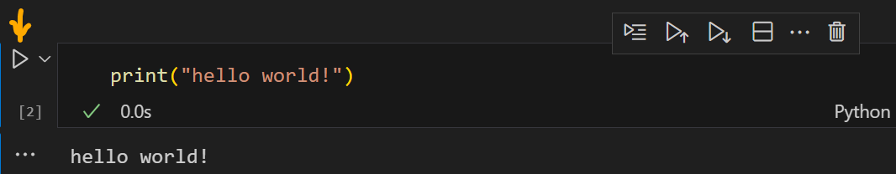
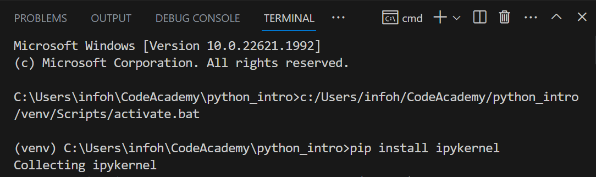
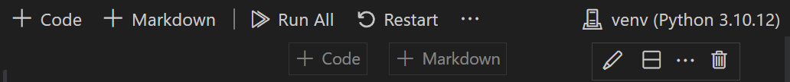
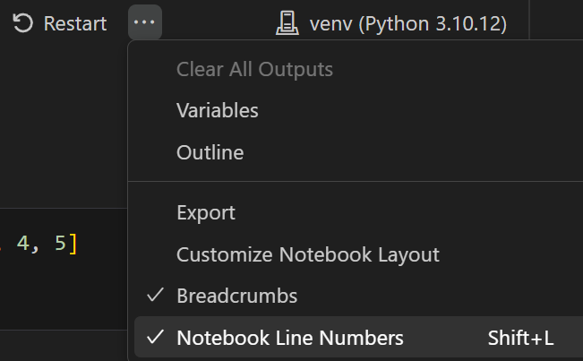
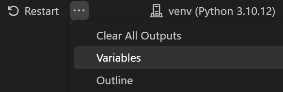

# Integration of Jupyter Notebook Experimental Environment with VS Code

## Introduction

Jupyter Notebook is an open-source web application that allows users to create and share documents containing program code, equations, visualizations, and text. It provides an interactive environment where you can write and execute code, view results, and add explanatory text in Markdown format.
Jupyter Notebook allows you to run individual code cells, making it easier to test and debug code. You can modify and rerun specific parts of the code, enabling faster program development.
Essentially, using Jupyter "Notebook" as an experimental environment within "VS Code" can provide interactive, visual, and collaborative features that are valuable for data exploration, prototyping, and documentation. However, there may be limitations related to code structure, version control, performance, and advanced IDE features. The choice between Jupyter "Notebook" and regular .py files depends on the specific use case and requirements of your project.

# Installation and Integration with VS Code

To configure Jupyter Notebook in the integrated environment of VS Code, follow these steps:

1. Install the Jupyter extension: Open "VS Code," go to the Extensions view (Ctrl+Shift+X/Cmd+Shift+X or View > Extensions in the menu), and search for "Jupyter." Install the Jupyter extension if it's not already installed with Python.

2. Create a new Jupyter Notebook file: Open the Command Palette (Ctrl+Shift+P or View > Command Palette) and search for "Jupyter: Create New Blank Jupyter Notebook." Select this option to create a new Jupyter Notebook file. Alternatively, you can simply create an empty file in the File Explorer and name it with the .ipynb extension.

3. Select a kernel: After creating a new Notebook, you will be prompted to select a kernel. Choose the recently created virtual environment (venv) 
 and, if prompted, allow access through the Windows Firewall.

4. Execute code cells: In the newly created Jupyter Notebook file, you can start writing and executing code cells using the Ctrl+Enter shortcut or by clicking the play button on the left side of the code cell. Each code cell can be executed independently, and the result of the last code line will be displayed below the cell.

5. You may be asked to install interactive Python and Jupyter modules in your Python virtual environment if they are not already installed. Choose the Install option. This may take some time. In case of errors, you can try running the "pip install ipykernel" command in the terminal, but make sure your virtual environment is activated first.

Upon successful installation, your code cells will execute successfully, and the output will be displayed.

Additional features: The Jupyter extension for VS Code provides various features such as code autocompletion, code formatting, and debugging capabilities. You can access these features through the VS Code interface to enhance your Jupyter Notebook experience.

Saving and sharing: You can save your Jupyter Notebook just like any other file in VS Code. It will be saved with the .ipynb extension. You can also share the .ipynb file with others, and they can open and execute your Jupyter Notebook in their own Jupyter Notebook environments.

Notebook kernel: Jupyter Notebook supports multiple programming languages through different kernels. You can change the kernel associated with a Notebook using the kernel menu in the toolbar. This allows you to work with languages other than Python, such as R or Julia.

## Restarting the Kernel

When working with Jupyter Notebook, sometimes the kernel (execution environment) can become stuck or unresponsive. In the VS Code environment, you can quickly restart the kernel:
Click the Restart/Restart Kernel button (usually represented as a circular arrow symbol) at the top of the Notebook interface.

Using the Command Palette (Ctrl+Shift+P or View > Command Palette), select "Jupyter: Restart Kernel."
Restarting the kernel can resolve variable conflicts, stuck computations, and other issues.

## Displaying Line Numbers in Code Cells

It's convenient, especially in large code blocks, to see line numbers for each line of code. However, please note that these line numbers are not considered part of the code. You can enable line numbers from the expanded Jupyter toolbar menu (...), located to the right of the Restart button.

## Displaying Images and Visualization Libraries

Jupyter Notebook supports integration with popular Python visualization libraries such as Matplotlib, Seaborn, Plotly, and others. When generating plots or visualizations using these libraries in the Jupyter Notebook environment within VS Code, the outputs are displayed below the code cell, as intermediate results. This makes it easy to monitor your data analyses and visualization outcomes in real-time. This will be a fundamental part of our data science course.

## Variable Browser and Data Inspection

The Jupyter extension for VS Code includes a variable browser and data inspection feature. This allows you to view the values of variables, data frames, and other data structures in your Notebook. It's an excellent tool for quickly understanding the shape and content of your data.
To access the variable browser, in the expanded Jupyter toolbar menu (...), located to the right of the Restart button, you can find the "Variables" option.

## Derinimas ("Debugging") Jupyter kodo daliu

VS Code allows you to debug Jupyter code cells, making it easier to troubleshoot issues in your Notebook. To start debugging:
Click on the Debug Cell icon (typically represented as a combination of bug and play icons) at the top left of the code cell.
The debugging tool will activate, and you'll be able to set breakpoints, inspect variable values, and step through the code.
This can be a powerful way to identify and resolve issues in your Jupyter Notebook code.

## Keyboard Shortcuts in the Jupyter Environment

The keyboard shortcuts in the Jupyter environment are well-documented in an article that explains Jupyter keyboard shortcuts, and all of them work in the "VS Code" environment as well.
[Jupyter keyboard shortcuts](https://towardsdatascience.com/jypyter-notebook-shortcuts-bf0101a98330)

## Conclusions

Integrating Jupyter Notebook into the VS Code environment provides a powerful combination of interactivity, visualization, and the robust features of a professional IDE. Whether you're analyzing data, building machine learning models, or simply prototyping, this configuration can enhance your productivity and streamline the development process.